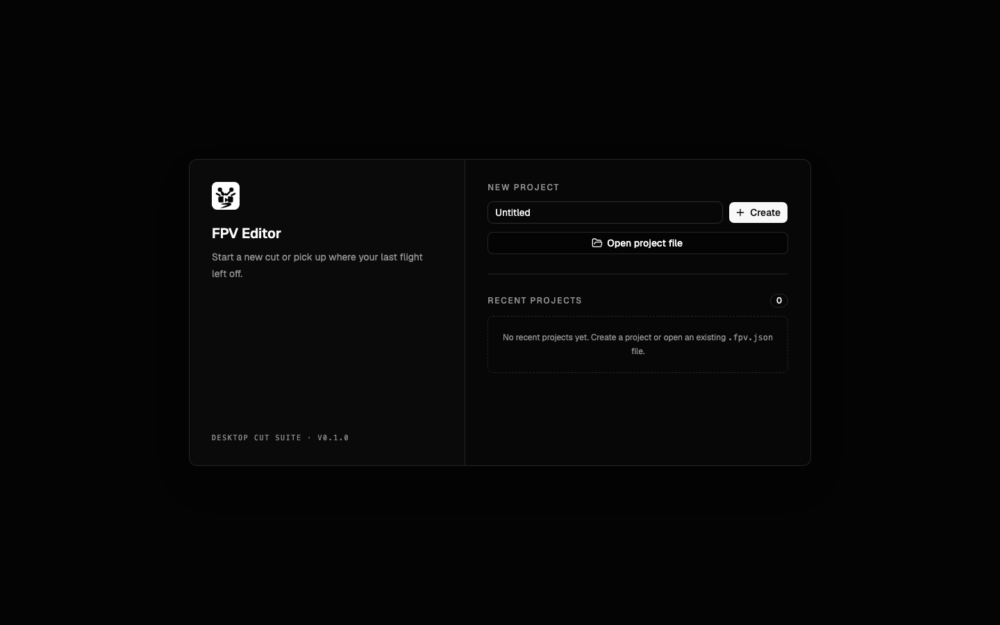

<p align="center">
  
</p>

<h1 align="center">FPV Editor</h1>

<p align="center">A native, open-source video editor built for FPV drone pilots.</p>

<p align="center">
  <a href="#getting-started">Get started</a> ·
  <a href="#features">Features</a> ·
  <a href="#contributing">Contributing</a> ·
  <a href="LICENSE">MIT License</a>
</p>



FPV Editor brings the FPV post-flight workflow into one native desktop application:
import your flight footage, build a multi-track cut, tune stabilization, apply LUTs, and
deliver an edit. The Rust core is shared by the desktop UI, CLI, AI copilot, and MCP
server, so every timeline change uses the same command bus with undo/redo support.

## Features

- Native Tauri desktop app with a focused flight-deck editing interface
- Multi-track timeline, trims, splits, project open/save, and undo/redo
- FFmpeg-powered probing, proxy creation, and clip export
- FPV stabilization tools: gyro integration, horizon lock, rolling-shutter correction,
  lens-distortion modelling, and dynamic-FOV crop calculation
- `.cube` LUT parsing and GPU/CPU color-processing paths
- Headless CLI for scripted workflows
- Configurable OpenAI-compatible AI copilot and an MCP server for external agents

## Getting started

### Prerequisites

- Rust stable (edition 2021)
- Node.js and npm
- `ffmpeg` and `ffprobe` on `PATH` for media operations and the full test suite
- A usable `wgpu` adapter for GPU tests (Metal, Vulkan, or DX12)

On macOS, FFmpeg can be installed with:

```sh
brew install ffmpeg
```

### Run the desktop editor

```sh
git clone https://github.com/mroxso/FPVEditor.git
cd FPVEditor
cd frontend && npm install && cd ..
cargo run -p fpv-app
```

The frontend development server is available separately at `http://127.0.0.1:1420`:

```sh
cd frontend
npm run dev
```

### Use the CLI

```sh
cargo run -p fpv-cli -- new project.fpv.json --name "My Edit"
cargo run -p fpv-cli -- add-track project.fpv.json --kind video --name V1
cargo run -p fpv-cli -- add-clip project.fpv.json --track <track-id> \
  --source run.mp4 --in 0 --out 12
cargo run -p fpv-cli -- stabilize project.fpv.json --clip <clip-id> \
  --smoothness 0.6 --strength 1.0 --horizon-lock --dynamic-fov 0.15
cargo run -p fpv-cli -- export project.fpv.json --clip <clip-id> --output out.mp4
```

To expose a project to an external MCP-capable agent:

```sh
cargo run -p fpv-cli -- mcp-serve project.fpv.json
```

## Development

```sh
cargo test --workspace
cargo clippy --workspace --all-targets
cargo fmt --all -- --check
cd frontend && npm run build
```

Media and GPU tests skip gracefully when their required tools or hardware are unavailable.

## Project status

The core editing model, command bus, media wrapper, GPU color path, CLI, AI/MCP
integration, and desktop shell are implemented and covered by workspace tests. The
stabilization math is implemented, but frame-by-frame stabilization rendering is not yet
wired into clip export; current exports reserve the dynamic-FOV crop without applying
the final de-shake warp. See [PLAN.md](PLAN.md) for the architecture and remaining work.

## Architecture

The workspace is organized around a shared Rust core:

| Crate | Responsibility |
| --- | --- |
| `fpv-core` | Project model, commands, undo/redo, JSON project files |
| `fpv-media` | FFmpeg/FFprobe integration, proxies, and exports |
| `fpv-stabilize` / `fpv-gpu` | Stabilization and image-processing primitives |
| `fpv-ai` / `fpv-mcp` | AI tool catalog and MCP server |
| `fpv-cli` / `fpv-app` | Headless and desktop entry points |

## Contributing

Contributions are welcome. Please open an issue to discuss significant changes, then
send a focused pull request with tests and a clear description of the behavior change.
Use conventional commit messages and run the checks in [Development](#development)
before submitting. For visible UI changes, include a screenshot in the pull request.

Do not commit API keys, provider credentials, or custom authorization headers.

## License

FPV Editor is released under the [MIT License](LICENSE).
